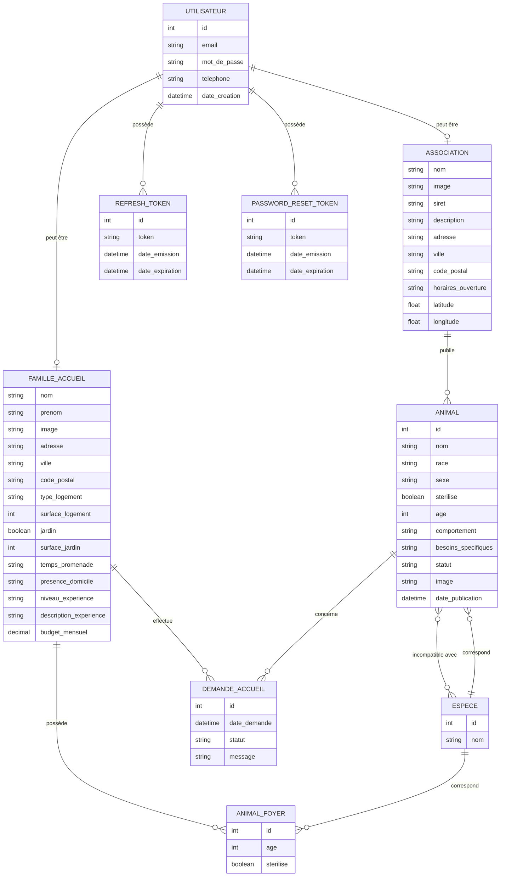

# MCD — Pet Foster Connect

Ce MCD reprend les données réellement présentes dans le projet, sans les types SQL ni les clés étrangères.

## Version classique



### Cardinalités principales

- Un **utilisateur** peut avoir un profil famille d'accueil ou un profil association.
- Une **association** peut publier plusieurs animaux, mais un animal appartient à une seule association.
- Une **espèce** peut concerner plusieurs animaux, mais un animal appartient à une seule espèce.
- Un **animal** peut être incompatible avec plusieurs espèces et une espèce peut être incompatible avec plusieurs animaux.
- Une **famille d'accueil** peut avoir plusieurs animaux dans son foyer.
- Une **famille d'accueil** peut faire plusieurs demandes d'accueil.
- Un **animal** peut recevoir plusieurs demandes d'accueil.
- Un **utilisateur** peut posséder plusieurs jetons de session et de réinitialisation.

## Version Mocodo

https://www.mocodo.net/?mcd=eNqVVE2PmzAQvfMr_AM4NNfc2MRRrRJAQFTtyXJgNusWsGubaPvv6w_COtu0VYWEzXhm3sx7Y7bJ1j41PtS4-Uzb8gsutoj3KTLiO0wp6pkBCiPXmov1801yxYw1-OBtsixV2TR4j2t6ly5Fnwp0aklOmqzFpzpFmw2683jPcsiOJM8xzXa7Eyb5Fk1iTJFU4Fc-sgukiPUKtLabKx8Gu3SiByqFNmywZf-UQAdxgREmkyI9qxfWxZZvTPV8ej-5fRsYpaZSCevGevCoGibr0YuRd9whTfwKbHb9g-LuzBICulNcOjLu7Oe5v4ChNpmeYUhwW2O6dGcJ2fxGyIfOk-g86AEj47a_URjq2mWeAQMDyFcxwaJMpyDo4vGypil3JGtJWTzEjM6TaL-wvrCtuQJz1-c_FHgVitkYTcV8BWVmZR0GW5WZHauDmC5--3BsGtz-ZWgqW-TXst7Hji7-9JQTXPuQu5ZdiwU5ZnnAWnGC0ft_oD2KoYfyGdcu7AHq_12RkDDEeGoVcyOi4c29jZ2ZgTs2Pd-dGKVQZpnWM2jBJ021hI6_8B8zaBfCzGxWhTygnM8D726IK2joIkAHOW9w_rYROyV7fMyKPX5Mh6M0qt5D9XYUpx7e6xjtMNjkSVZVWd3igtQUNxXehZy3bazGor2f0j2m7XP1B99VBe9Kil15rKy6TzmOaotC499RsKy0B-svTKCCjg==
```

## Relations principales

- Un utilisateur peut avoir un profil **famille d'accueil** ou un profil **association**.
- Une association peut publier plusieurs animaux.
- Un animal appartient à une seule espèce.
- Un animal peut être incompatible avec plusieurs espèces.
- Une famille peut renseigner plusieurs animaux déjà présents dans son foyer.
- Une famille peut envoyer plusieurs demandes d'accueil.
- Un animal peut recevoir plusieurs demandes.
- Un utilisateur peut posséder plusieurs jetons de session ou de réinitialisation.

> Dans la base de données, l'exclusivité entre le profil famille et le profil association n'est pas imposée directement par une contrainte SQL. Elle est gérée par le fonctionnement de l'application.
