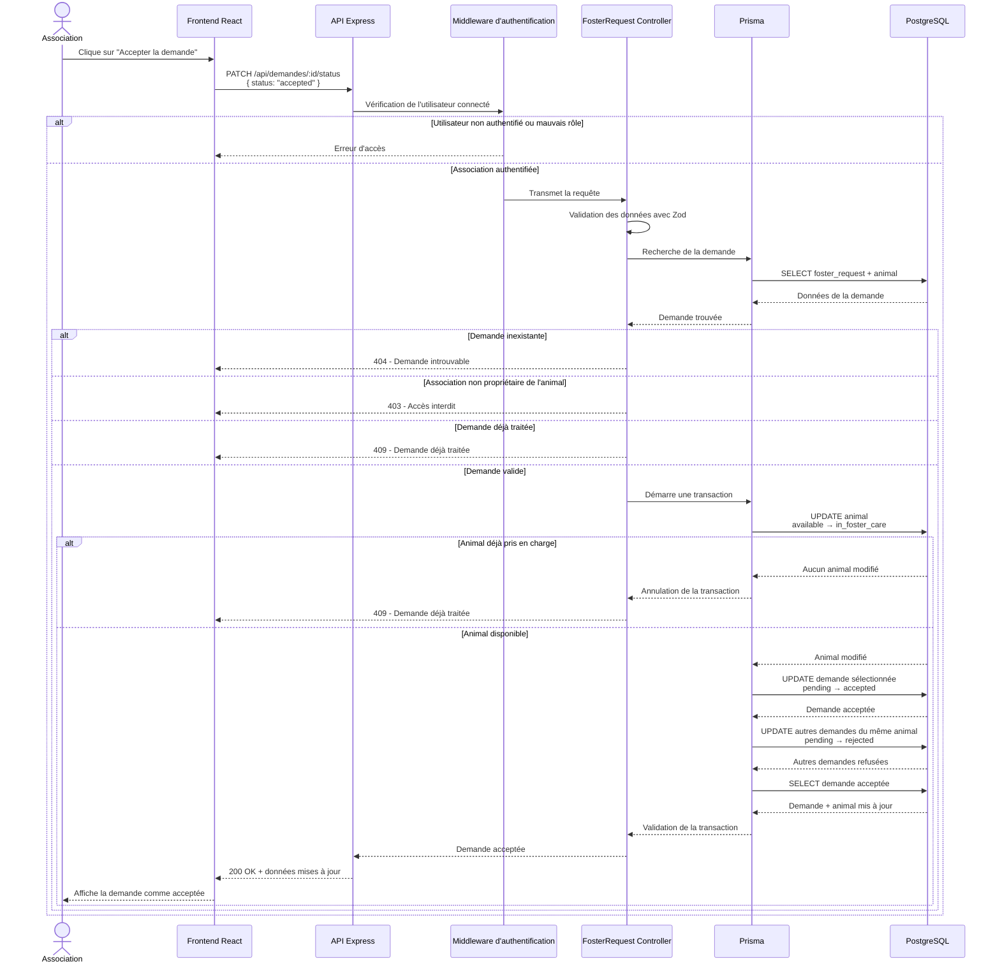

# Diagramme de séquence — Acceptation d'une demande d'accueil

Pour la fonctionnalité complexe, j'ai choisi **l'acceptation d'une demande d'accueil par une association**.

Cette fonctionnalité est intéressante à représenter car elle ne modifie pas seulement la demande sélectionnée : elle change aussi le statut de l'animal et refuse automatiquement les autres demandes encore en attente pour ce même animal.

## Diagramme de séquence

## Résumé du fonctionnement

Lorsqu'une association accepte une demande, l'API vérifie d'abord que l'utilisateur est bien connecté et possède le rôle `association`.

Le contrôleur vérifie ensuite que la demande existe, qu'elle appartient bien à un animal de cette association et qu'elle est toujours en attente.

L'acceptation est ensuite réalisée dans une **transaction Prisma**. Trois opérations principales sont effectuées :

1. l'animal passe du statut `available` à `in_foster_care` ;
2. la demande sélectionnée passe de `pending` à `accepted` ;
3. les autres demandes encore en attente pour cet animal passent automatiquement à `rejected`.

La transaction permet d'éviter qu'une même demande ou deux demandes différentes pour le même animal soient acceptées en même temps.
